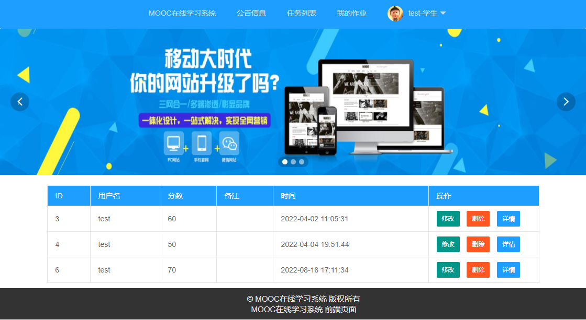
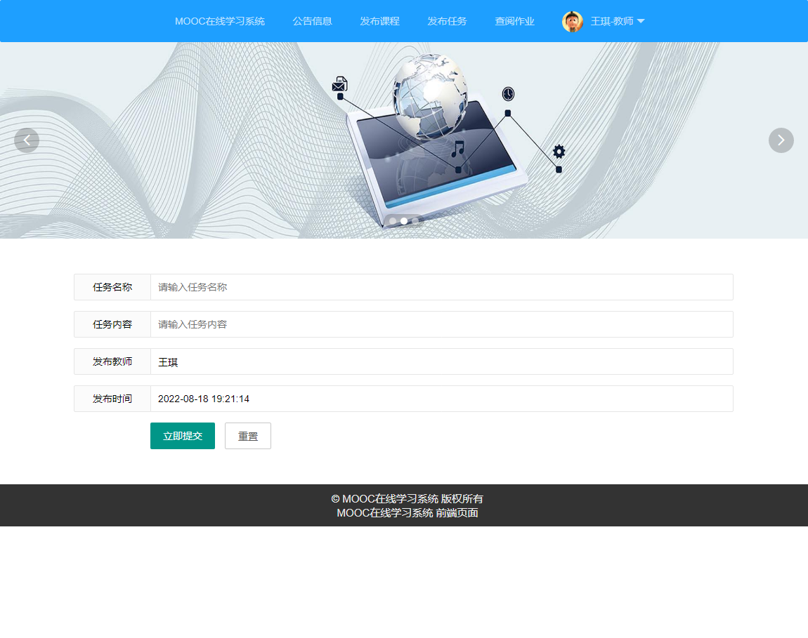

# MOOC在线学习系统

## 项目功能介绍
A1026-MOOC在线学习系统 的设计与实现,前后端分离项目，系统包括学生用户和教师、管理员三种角色
系统设计实现包括如下功能：用户（教师和学生）信息功能模块,课程信息功能模块,作业信息功能模块,
评论信息功能模块,公告信息功能模块,课程分类信息功能模块,学习记录功能模块,
管理员信息功能模块,试题题目功能模块,考试结果功能模块,课程任务信息功能模块等等。

【特色功能】：学生在线考试，作业提交，学习情况统计，在线学习

## 项目运行部分截图
### 项目功能比较多，下面是部分运行截图

## 软件架构
后台技术： SSM框架和Springboot框架两个版本代码

前端技术： vue 和 jsp两个版本

数据库：   Mysql5.x/8.x版本都可以

开发工具： Eclipse、idea、MyEclipse、NetBeans都可以运行

jdk版本： jdk1.8+

【如果不会运行，可以找我们远程帮助调试运行】

数据库每个表都有详细注释

代码也有详细注释（详细说明）

# 完整源码获取
## 获取源码请加扣扣 1516993194  或者  2551449109
